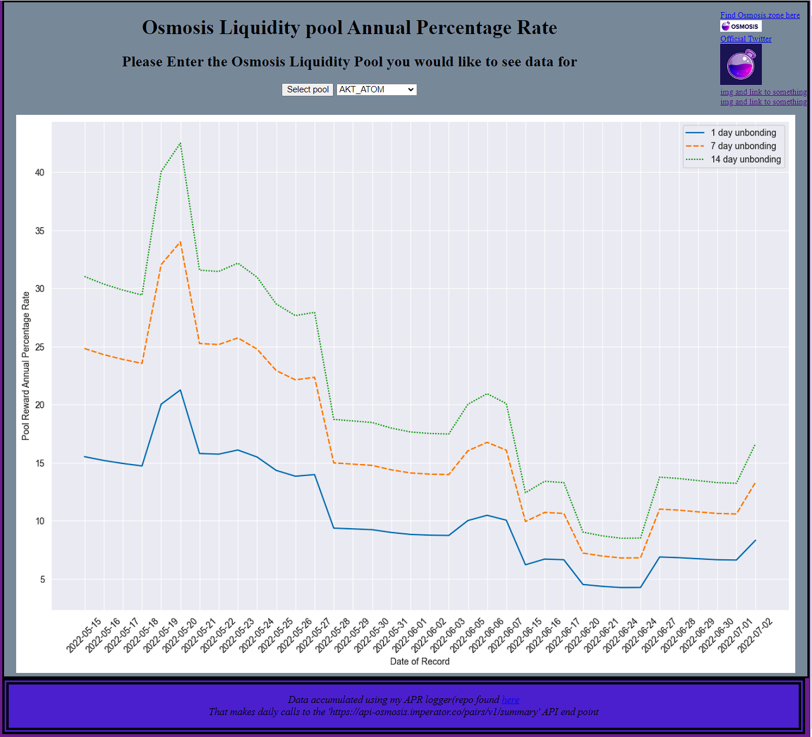

## LP_apr_history_data
 visualization of historical data for Osmosis crypto liquidity pool apr data
 
 still under development
 
 planned AWS services: Lambda, S3, Elastic Beanstalk, CloudWatch Events
 
 lambda function scheduled to run once daily:
  (taken from my [OSMO_logger repo](https://github.com/logical1862/OSMO_logger), configured for s3 and lambda)
  -makes request to API for pool data, reads APR data from response as Pandas Dataframe, converts to csv, saves to s3 bucket
  
  Flask App:
  reads data from s3 bucket. data passed to helpers.save_plot_image() to plot line graph figure, save figure as .png in static directory, then rerenders page with selected pool (selected from html page)
 
 
 
 major issues:
  configuration for AWS S3 bucket for database
  
  change db from sqlite3 to better alternative
  
  intital render of page renders outdated static plot img
  

### Description:

## Tech:

Python, Flask, SQLite, HTML, CSS, and Jinja

## Background:

OSMO is a cryptocurrency that acts as a decentralized exchange for different crypto assets on the COSMOS chain.
The data vusualized here is the APR yield for different 'Liquidity Pools' that OSMO provides. The data has been aggregated over time by calling an API with on-chain data and saving it to 'pool_apr.db'.

A Liquidity Pool is a pair of crypto assets. The pools acts serves as liquidity for trades between the pairs. Deposits to the pool are incentivized with interest payments. The yield of interest on those pools over time are the data points for each plot.

## Structure:

- When a user first visits the site, the back-end creates a connection to 'pool_apr.db', executes a sqlite query to select the names of all tables, assigning the return value to 'name_list'.

- The initial visit to the page is pre-configured to display a 'first load' rendering of 'index.html' by statically setting the image path.
    both 'name_list' and the image path are passed to 'render_template()'

- 'index.html' renders a page that displays a saved image of a seaborn line plot. 'name_list' is implemented here as a html select form that gives users the option to choose different tables to visualize as line plots.

- When a user submits a different plot, it is submitted as a post request to 'index.html' where the selection is given the variable name 'pool_plot_img_selection'.

- 'pool_plot_img_selection' is passed to pandas.read_sql to read the table date as a DataFrame. The DataFrame is then passed to helpers.save_plot_image() to generate a plot figure via matplotlib and seaborn, then saving that image in 'static/plot_imgs/'.

- The new image path is passed to render_template() to return the newly generated image for the selected table. A flask flash() message is displayed to show the user which table was selected to visualize.

## helpers.py

helpers.py contains one helper function: save_plot_image().

save_plot_image() takes two arguments (df: pd.DataFrame, file_name: string).

Uses matplotlib, seaborn, and pandas libraries.

### save_plot_image()
-set style to dark grid

-set figure size

-plot data with df

-format plot ticks / labels

-set save directory

-remove excess image border via bbox=tight and save image to directory

##example of index.html when in production

